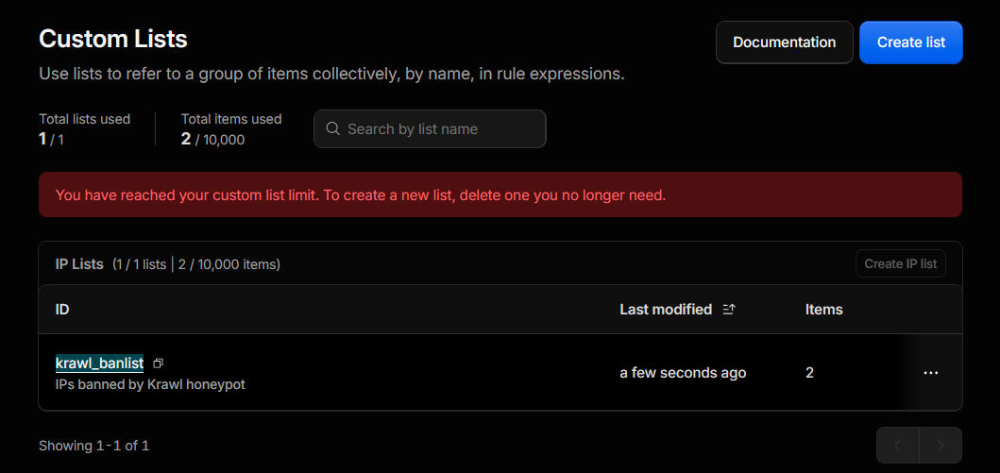
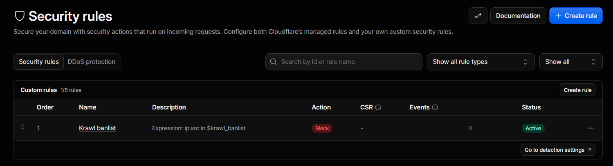

# Cloudflare Banlist Sync

When a site sits behind Cloudflare's proxy, the origin server never sees the real client IP every request arrives from Cloudflare's edge IP ranges, and the actual attacker IP is only available in the **CF-Connecting-IP header**. This means IP bans applied at the origin, such as iptables, fail2ban, or application-level blocklists, are largely ineffective, since you'd be blocking Cloudflare's own infrastructure instead of the attacker, while the malicious traffic keeps flowing through the proxy to your app.

To solve this, we implemented banning at the edge instead of the origin. Krawl pushes banned IPs directly into a Cloudflare Account IP List via the API, and that list is referenced in a Cloudflare WAF rule. This means the block happens before the request ever reaches your infrastructure, at Cloudflare's network layer, using the real client IP that Cloudflare itself observed rather than a spoofable header.

The integration works on Cloudflare's free plan, which supports one IP List with up to **10,000 entries**. A background task performs the sync on a configurable interval, using full list replacement rather than incremental updates. Everything is configured from the Webhooks tab in the Krawl dashboard, with no manual API token setup or curl commands required. Once active, the list is visible under the Cloudflare account's Lists configuration and can be attached to any WAF custom rule.

## Prerequisites

You need a Cloudflare API token, plus your Account ID (and Zone ID if you want automatic rule creation).

### Creating the API token

1. Go to https://dash.cloudflare.com/profile/api-tokens and click **Create Token**
2. Scroll to the bottom of the templates and click **Get started** under **Custom token**
3. Give the token a name, e.g. `Krawl banlist sync`
4. Add these **Permissions**:
   - Account > Rule Lists > Read
   - Account > Rule Lists > Write
   - Zone > WAF > Edit (only needed for automatic WAF rule creation)
5. Under **Account Resources**, select *Include* > *All accounts* (or the specific account)
6. Under **Zone Resources**, select *Include* > *All zones from [your account]* (or the specific zone) — the token can't see zones outside this scope
7. Click **Continue to summary**, then **Create Token**, and copy the token value (shown once)

### Finding your IDs

- **Account ID** (32 hex characters): right sidebar on https://dash.cloudflare.com/, under "Account ID"
- **Zone ID** (32 hex characters): the zone's Overview page, right sidebar

Full reference: https://developers.cloudflare.com/fundamentals/account/find-account-and-zone-ids/

## Setup

1. Go to the Webhooks tab in the Krawl dashboard
2. Enter your Account ID and API Token
3. Enter your Zone ID (optional, enables automatic WAF rule creation) and pick a rule action (default: Block)
4. Set a list name (default: `krawl_banlist`)
5. Select which IP categories to include (attacker, bad_crawler, regular_user, good_crawler, timed_out)
6. Set the sync interval in minutes
7. Click Save

The server tests the connection, creates the list if it doesn't exist, creates the WAF rule if a Zone ID was given, and starts the background sync loop. The list appears at https://dash.cloudflare.com/YOUR_ACCOUNT_ID/configurations/lists, and the rule appears under Security > WAF > Custom rules.

Once the configuration is set up, the CloudFlare list page should appear like this:

The WAF rules section should be like this (https://dash.cloudflare.com/YOUR_ACCOUNT_ID/YOUR_ZONE_NAME/security/security-rules)

## How it works

The background task (`src/tasks/sync_cloudflare.py`) runs every 60 seconds. On each tick it checks whether the webhook is enabled and, if so, reads the current banlist from the database, filters for public IPs only, and does a full PUT replace of all items in the Cloudflare list.

The task **only updates the list**. It never touches the WAF rule — the rule is created and checked once, when you click Save. This keeps sync cheap and avoids churn on the ruleset; new bans appear in the list and the existing rule picks them up automatically.

If the list ID saved in config no longer exists (deleted from the Cloudflare dashboard), the task searches existing lists by name. If a match is found it uses that list ID; otherwise it creates a new list.

## Automatic WAF rule

When a Zone ID is configured, saving the config also creates a WAF custom rule for that zone that blocks any request whose source IP is in the banlist (expression `ip.src in $krawl_banlist`). The rule is idempotent: if a rule for the list already exists, it's left untouched and the save reports "WAF rule active" instead of creating a duplicate. The save response is split into two status lines in the dashboard:

- **Saved (krawl_banlist)** — confirms the connection, list, and config were saved
- **WAF rule active** / **WAF rule created** (green) — confirms the blocking rule exists on the configured zone

The "Cloudflare Configured List" and "Cloudflare Configured Rules" links under the form jump straight to the list and the zone's Custom rules page in the Cloudflare dashboard. Remove the Zone ID to keep using the list without an automatically managed rule.
