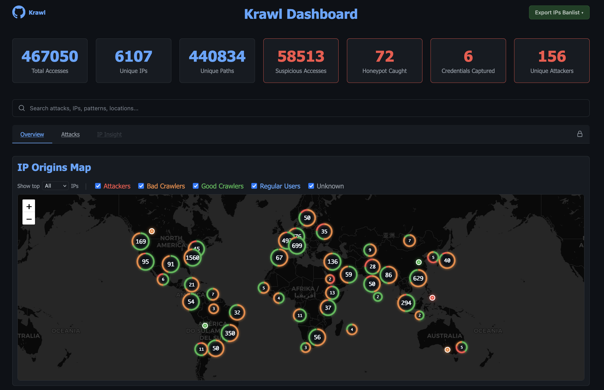
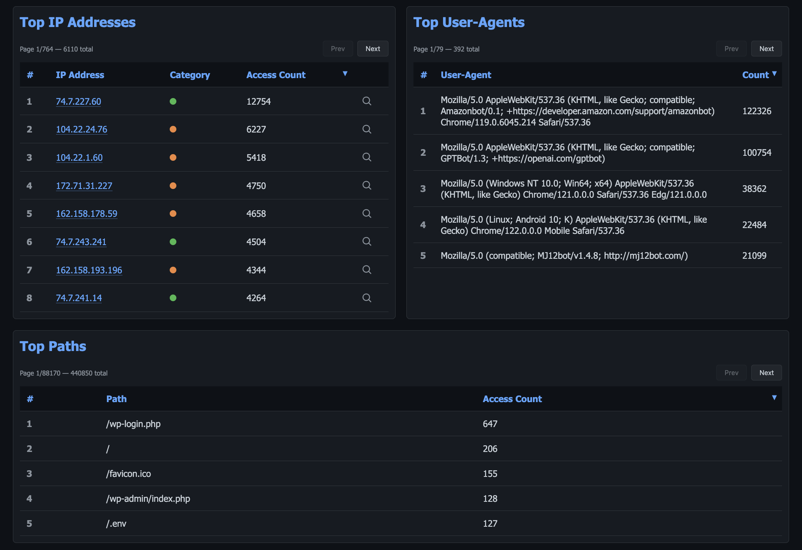
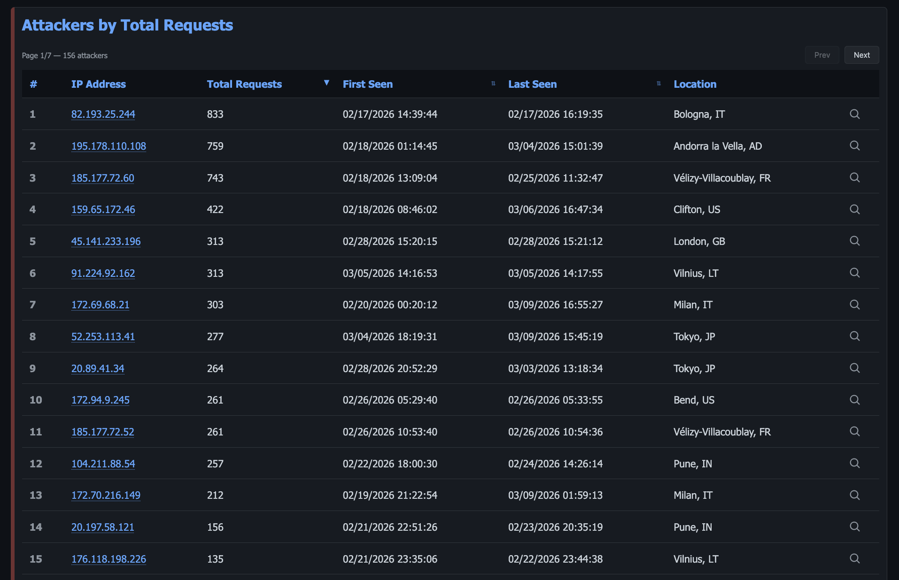
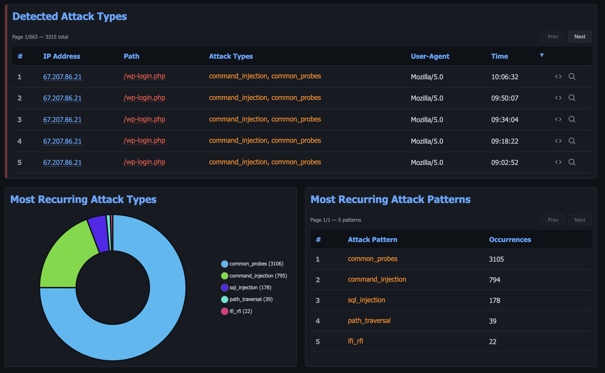
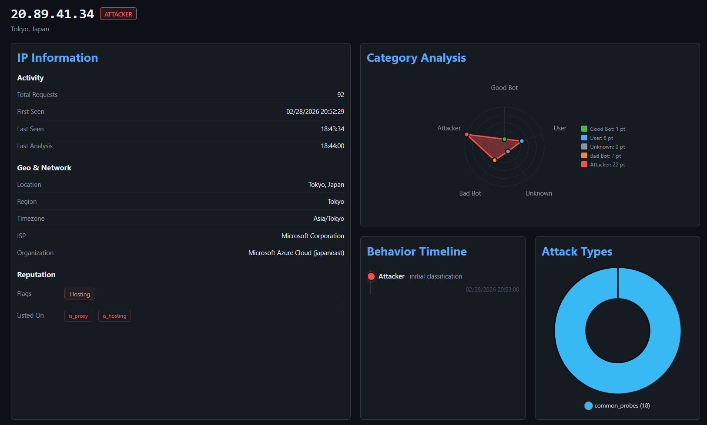
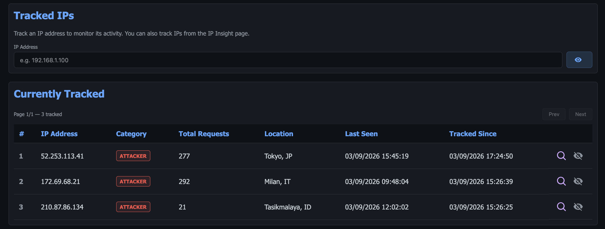
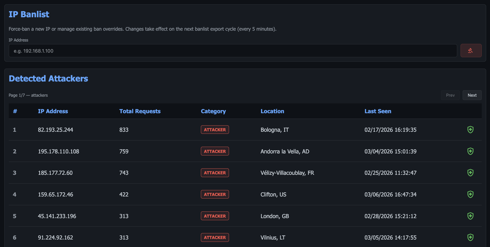
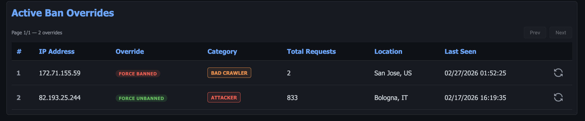
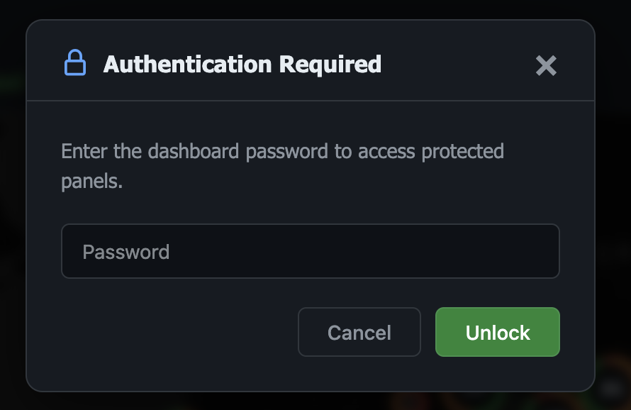

# Dashboard

Access the dashboard at `http://<server-ip>:<port>/<dashboard-path>`

The Krawl dashboard is a single-page application with four open tabs — Overview,
Attacks, Threats and IP Insight — and five more that appear once you authenticate
with the dashboard password: Tracked IPs, IP Banlist, Timed Out IPs, Deception
and Webhooks.

---

## Overview

The default landing page provides a high-level summary of all traffic and suspicious activity detected by Krawl.

### Stats Cards

Seven metric cards are displayed at the top:

- **Total Accesses** — total number of requests received
- **Unique IPs** — distinct IP addresses observed
- **Unique Paths** — distinct request paths
- **Suspicious Accesses** — requests flagged as suspicious
- **Honeypot Caught** — requests that hit honeypot endpoints
- **Credentials Captured** — login attempts captured by the honeypot
- **Unique Attackers** — distinct IPs classified as attackers

### Search

A real-time search bar lets you search across attacks, IPs, patterns, and locations. Results are loaded dynamically as you type.

### IP Origins Map

An interactive world map (powered by Leaflet) displays the geolocation of top IP addresses. You can filter by category:

- Attackers
- Bad Crawlers
- Good Crawlers
- Regular Users
- Unknown

The number of displayed IPs is configurable (top 10, 100, 1,000, or all).

Markers cluster as you zoom out, and each cluster is ringed in the proportions
of the categories inside it, so a cluster that is mostly attackers reads red
before you click it. The view fits itself to the visible markers rather than
opening at a fixed zoom, which keeps the framing right on any screen width and
re-fits when you toggle a category off. It will not zoom past a global
overview on load — panning in is left to you.

The basemap is deliberately desaturated so that the category colours are the
only saturated thing on the panel. See [Map tiles](#map-tiles) to change the
tile provider.



### Recent Suspicious Activity

A table showing the last 10 suspicious requests with IP address, path, user-agent, and timestamp. Each entry provides actions to view the raw HTTP request or inspect the IP in detail.

### Top IP Addresses

A paginated, sortable table ranking IPs by access count. Each IP shows its category badge and can be clicked to expand inline details or open the IP Insight tab.

### Top Paths

A paginated table of the most accessed HTTP paths and their request counts.

### Top User-Agents

A paginated table of the most common user-agent strings with their frequency.



---

## Attacks

The Attacks tab focuses on detected malicious activity, attack patterns, and captured credentials.

### Attackers by Total Requests

A paginated table listing all detected attackers ranked by total requests. Columns include IP, total requests, first seen, last seen, and location. Sortable by multiple fields.



### Captured Credentials

A table of usernames and passwords captured from honeypot login forms, with timestamps. Useful for analyzing common credential stuffing patterns.

### Honeypot Triggers by IP

Shows which IPs accessed honeypot endpoints and how many times, sorted by trigger count.

### Detected Attack Types

A detailed table of individual attack detections showing IP, path, attack type classifications, user-agent, request method, size, and timestamp. The size column is sortable, so the heaviest payloads surface first. Each entry can be expanded to view the raw HTTP request.

**Attachments.** When the request carried an upload — a webshell, a malware sample, an exfiltration payload — a paperclip button appears in the raw request modal listing the uploaded files, and downloads the one you click. Both `multipart/form-data` parts and raw-body uploads are recognised. Treat every download as hostile and open it in a sandbox. Requests with bodies above 64 KB are not buffered, so they have no retrievable attachment. The same data is available through the [Dashboard API](dashboard-api.md#attachments).

### Most Recurring Attack Types

A Chart.js visualization showing the frequency distribution of detected attack categories (e.g., SQL injection, path traversal, XSS).

### Most Recurring Attack Patterns

A paginated table of specific attack patterns and their occurrence counts across all traffic.



---

## Threats

The Threats tab groups captured payloads into campaigns. Krawl fuzzy-hashes
every captured file and flagged request body with TLSH, then clusters digests
within `analyzer.tlsh_cluster_threshold` of each other — so a webshell and its
lightly-edited variants land in one campaign rather than looking like unrelated
one-off hits.

Hashing runs as the scheduled `hash-payloads` task, not at request time: new
captures are hashed on the next run, and existing history is swept backwards
once, tracked by a watermark. A freshly upgraded instance therefore fills this
tab in over a few task cycles rather than immediately.

### Attack Campaigns

A bar chart of campaign activity over the selected span (1, 7 or 30 days), with
arrows to step through earlier periods. Clicking a bar loads that campaign's
events.

### Campaigns

Each recurring payload pattern, with how many times it was seen and how many
distinct IPs sent it. A campaign appears only once its payload has been seen
more than `analyzer.tlsh_campaign_min_events` times, which keeps one-off probes
out of the table.

### Captured Files

An index of every file Krawl captured, across all IPs — name, size, type and the
campaign it belongs to.

---

## IP Insight

The IP Insight tab provides a deep-dive view for a single IP address. It is activated by clicking "Inspect IP" from any table in the dashboard.

### IP Information Card

Displays comprehensive details about the selected IP:

- **Activity** — total requests, first seen, last seen, last analysis timestamp
- **Geo & Network** — location, region, timezone, ISP, ASN, reverse DNS
- **Category** — classification badge (Attacker, Good Crawler, Bad Crawler, Regular User, Unknown)

### Ban & Track Actions

When authenticated, admin actions are available:

- **Ban/Unban** — immediately add or remove the IP from the banlist
- **Track/Untrack** — add the IP to your watchlist for ongoing monitoring

### Blocklist Memberships

Shows which threat intelligence blocklists the IP appears on, providing external reputation context.

### Referer History

The `Referer` headers this IP arrived with, so you can see which bait link, page
or external source led it here. Empty unless `analyzer.referer_enabled` is on.

### Captured Files

Files this IP uploaded or requested, with the TLSH digest that ties each one to
a campaign. A file opens in place rather than downloading.

### Captured Credentials

The usernames and passwords this IP submitted to the login traps, filtered to
this address alone.

### Access Logs

A filtered view of all requests made by this specific IP, with full request details.



---

## Tracked IPs

> Requires authentication with the dashboard password.

The Tracked IPs tab lets you maintain a watchlist of IP addresses you want to monitor over time.

### Track New IP

A form to add any IP address to your tracking list for ongoing observation.

### Currently Tracked IPs

A paginated table of all manually tracked IPs, with the option to untrack each one.



---

## IP Banlist

> Requires authentication with the dashboard password.

The IP Banlist tab provides tools for managing IP bans. Bans are exported every 5 minutes.

### Force Ban IP

A form to immediately ban any IP address by entering it manually.

### Detected Attackers

A paginated list of all IPs detected as attackers, with quick-ban actions for each entry.



### Active Ban Overrides

A table of currently active manual ban overrides, with options to unban or reset the override status for each IP.



### Export Banlist

A dropdown menu to download the current banlist in two formats:

- **Raw IPs List** — plain text, one IP per line
- **IPTables Rules** — ready-to-use firewall rules

---

## Authentication

The dashboard uses session-based authentication with secure HTTP-only cookies. Protected features (Tracked IPs, IP Banlist, ban/track actions) require entering the dashboard password. The login includes brute-force protection with IP-based rate limiting and exponential backoff.

Sessions and the attempt counters live in Redis in scalable mode, so a cookie issued by one replica is accepted by every other one and the lockout applies per attacker rather than per pod. In standalone mode they are held in-process. Sessions expire after 12 hours, attempt counters after 1 hour.

Click the lock icon in the top-right corner of the navigation bar to authenticate or log out.



---

## Configuration

Dashboard behaviour is controlled under the `dashboard` section of `config.yaml` (or via environment variables).

### Secret path and password

```yaml
dashboard:
  secret_path: null       # auto-generated at startup if null
  password: null          # auto-generated at startup if null
```

| Env var | Description | Default |
|---|---|---|
| `KRAWL_DASHBOARD_SECRET_PATH` | Custom path for the dashboard | Auto-generated |
| `KRAWL_DASHBOARD_PASSWORD` | Password for protected dashboard panels | Auto-generated |

### Cache warmup

The dashboard pre-computes heavy queries in a background task every 5 minutes so that page loads are instant.

```yaml
dashboard:
  cache_warmup: true       # enable background warmup task
  warmup_pages: 10         # pages to pre-warm per table panel
  warmup_aggregation: false  # pre-compute full top_paths/top_ua aggregations
  top_n_min_count: 5       # minimum access count to appear in top paths/user-agents panels
```

| Env var | Description | Default |
|---|---|---|
| `KRAWL_DASHBOARD_CACHE_WARMUP` | Enable background warmup task | `true` |
| `KRAWL_DASHBOARD_WARMUP_PAGES` | Pages to pre-warm per table panel | `10` |
| `KRAWL_DASHBOARD_WARMUP_AGGREGATION` | Pre-compute full top_paths/top_ua aggregations for zero-query serving | `false` |
| `KRAWL_DASHBOARD_TOP_N_MIN_COUNT` | Minimum access count for top paths/user-agents (set to `1` to disable filtering) | `5` |

> **Scalable mode**: `warmup_aggregation` is enabled by default in Helm and Kubernetes deployments. In standalone mode it is disabled because SQLite handles the load without it.

### Branding

The top-left corner of the dashboard — mark, name, version and an optional
contact — comes from config, so a deployment can carry your own team's name
and a way to reach whoever runs it.

```yaml
dashboard:
  branding:
    name: "Krawl"
    url: "https://github.com/BlessedRebuS/Krawl"  # null renders the name as plain text
    logo: null             # image URL shown instead of the GitHub mark
    show_version: true
    contact: null          # "soc@example.com", a URL, or plain text
```

`name` also sets the page heading (`<name> Dashboard`). `contact` is rendered
as a `mailto:` link if it looks like an address and as a link if it is an
`http(s)` URL; anything else ("Ext. 4471") stays unlinked text. `url` and
`logo` accept only `http(s)` or dashboard-relative paths — anything else is
dropped rather than placed in the page.

| Env var | Description | Default |
|---|---|---|
| `KRAWL_DASHBOARD_BRAND_NAME` | Wordmark and heading name | `Krawl` |
| `KRAWL_DASHBOARD_BRAND_URL` | Where the wordmark links | Krawl's repository |
| `KRAWL_DASHBOARD_BRAND_LOGO` | Image URL replacing the GitHub mark | Unset |
| `KRAWL_DASHBOARD_BRAND_SHOW_VERSION` | Show the version next to the name | `true` |
| `KRAWL_DASHBOARD_BRAND_CONTACT` | Contact shown under the wordmark | Unset |

### Map tiles

The IP Origins Map fetches its basemap from a tile provider. The provider is
configured under the `map` section, so switching it never needs a code change.

```yaml
map:
  tile_url: "https://services.arcgisonline.com/ArcGIS/rest/services/Canvas/World_Dark_Gray_Base/MapServer/tile/{z}/{y}/{x}"
  attribution: "&copy; Esri, HERE, Garmin, &copy; OpenStreetMap contributors"
  subdomains: "abcd"
  api_key: ""
  api_key_param: "api_key"
```

| Env var | Description | Default |
|---|---|---|
| `KRAWL_MAP_TILE_URL` | Tile URL template. `{z}`, `{x}` and `{y}` are required; `{s}` (subdomain) and `{r}` (retina suffix) are optional | Esri dark canvas |
| `KRAWL_MAP_TILE_ATTRIBUTION` | Credit line shown in the map corner | Esri / OSM |
| `KRAWL_MAP_TILE_SUBDOMAINS` | Values substituted into `{s}` | `abcd` |
| `KRAWL_MAP_API_KEY` | Appended to every tile request as a query parameter | _(empty)_ |
| `KRAWL_MAP_API_KEY_PARAM` | Name of that query parameter | `api_key` |

Note the axis order: Esri serves tiles as `{z}/{y}/{x}`, while most other
providers use `{z}/{x}/{y}`. Copy the template exactly as the provider
documents it.

#### Choosing a provider

**Esri dark canvas (default)** needs no account and adds no watermark. It is
the reason the map works out of the box.

**CARTO** requires an API key. Without one, every tile comes back with
`API KEY REQUIRED` stamped diagonally across it — the tiles still load, so
there is no error to notice, just a defaced map. Sign up at
[carto.com/basemaps/apikey](https://carto.com/basemaps/apikey), then:

```yaml
map:
  tile_url: "https://{s}.basemaps.cartocdn.com/dark_all/{z}/{x}/{y}{r}.png"
  attribution: "&copy; CARTO | &copy; OpenStreetMap contributors"
  api_key: "your-key-here"
```

Use the **raster** endpoint above, not the vector one. CARTO's documentation
leads with vector basemaps — a `style.json` handed to MapLibre GL. This map is
Leaflet, and `tile_url` is a raster `{z}/{x}/{y}` template; a style URL in that
field produces a blank basemap with no error in the console. The raster
`basemaps.cartocdn.com` endpoints are still served, and the tiles are pushed
through a desaturating filter anyway, so vector buys nothing here. The same
applies to any other provider that documents itself style-JSON-first
(MapTiler, Stadia): find their raster tile template.

Providers disagree on what to call the query parameter — CARTO and Stadia want
`api_key`, Thunderforest `apikey`, MapTiler `key` — so `api_key_param` sets it.
It defaults to `api_key`, which is what CARTO expects, so the block above works
as written.

**OpenStreetMap** needs no key but is light-themed, so it fights the dashboard
until you invert it. Add this to your own CSS after setting the URL:

```css
#attacker-map { --map-tile-filter: invert(1) hue-rotate(180deg) brightness(0.75) saturate(0.4); }
```

Also read [OSM's tile usage policy](https://operations.osmfoundation.org/policies/tiles/)
before pointing a busy instance at it.

**A self-hosted tile server** is just another `tile_url`. Worth considering:
the dashboard is normally the only page you open on the instance, and every
other option tells a third-party CDN when you are looking at it.

#### Two things to know

**The API key is public.** The browser fetches tiles directly, so the key is
served in the page source. That is unavoidable for a client-side map — restrict
the key to your dashboard's domain at the provider rather than trying to hide
it.

On Kubernetes the key still never touches the ConfigMap. Setting
`config.map.api_key` creates a chart-managed Secret and injects it as
`KRAWL_MAP_API_KEY`; to keep it out of your values file entirely, point
`mapExistingSecret` at a Secret you manage (External Secrets Operator, Vault,
sealed-secrets):

```yaml
mapExistingSecret:
  name: krawl-map-tiles
  key: map-api-key
```

**Attribution is a licence condition** for every provider above, not
decoration. It is styled to be unobtrusive; do not remove it.

#### Adjusting how the basemap looks

The tiles are desaturated and darkened so the category colours stand out. The
treatment is a single custom property, so you can retune it without touching
the rule:

```css
#attacker-map { --map-tile-filter: saturate(0.35) brightness(0.62) contrast(1.05); }
```

## Design system

The dashboard UI is a console for reading attacker traffic, and the styles are
built around that. Everything visual is defined once, as tokens, at the top of
`src/templates/static/css/dashboard.css`.

### Tokens

| Group | Tokens | Notes |
|---|---|---|
| Surfaces | `--bg` `--surface` `--raised` `--sunken` `--line` `--line-soft` `--scrim` | Deep console canvas, cards one step up |
| Text | `--text` `--text-strong` `--text-dim` `--text-faint` | All AA or better on `--bg` and `--surface` |
| Semantics | `--accent` `--danger` `--warn` `--ok` `--violet` `--pink` `--cyan` | Links and primary actions use `--accent` |
| Categories | `--cat-attacker` `--cat-bad-crawler` `--cat-good-crawler` `--cat-regular-user` `--cat-timed-out` | Threat class, aliased onto the semantics |
| Signal | `--honey` | **Reserved for honeypot triggers.** Nothing else is honey |
| Type | `--font-ui` `--font-mono`, `--fs-2xs` … `--fs-2xl` | Seven steps, no ad-hoc sizes |
| Space | `--s1` … `--s10` | 4px base |
| Radius | `--r-sm` `--r-md` `--r-lg` `--r-pill` | Controls / cards / modals / pills |
| Icons | `--icon-sm` `--icon` `--icon-lg` | 12 / 16 / 20 |

### Rules

- **Log data is mono.** IP addresses, request paths, user agents, timestamps and
  credential pairs use `--font-mono` so columns align and `0`/`O` and `1`/`l`
  stay distinguishable. Labels, prose and controls use `--font-ui`.
- **Honey means a trap was sprung.** Attack volume is red because it is a threat;
  a tripped honeypot is the product working, and it owns the only warm color on
  the page (the two trap-count stat cards and the honeypot trigger counts).
- **One icon system.** Inline Octicon SVGs on a 16 viewBox, sized by `.icon`,
  `.icon-sm` or `.icon-lg`, filled with `currentColor`. No icon webfont.
- **Category colors come from the tokens**, including in JavaScript — `map.js`,
  `radar.js` and `charts.js` read them through `krawlCategoryColors()` in
  `tokens.js`, so a category cannot look one way in a table and another on the map.
- **No `style="…"` in templates.** Add a class to `dashboard.css` instead; the
  component layer at the bottom of the file exists for exactly this. The only
  inline styles left are Alpine's initial `display: none` and colors computed
  per-row on the server.
