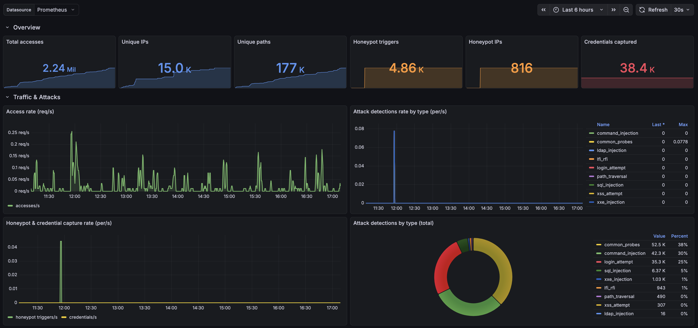

# Metrics & Monitoring

Krawl exposes [Prometheus](https://prometheus.io/) metrics and ships with a ready-to-import [Grafana](https://grafana.com/) dashboard so you can observe traffic, honeypot activity, and attack detections in real time.

## The Metrics Endpoint

Metrics are served in Prometheus text format at:

```
/<dashboard_secret_path>/metrics
```

The endpoint lives **under the secret dashboard path** so it isn't publicly discoverable. When metrics are disabled the endpoint returns `404` and the background refresh helpers become no-ops.

## Configuration

### Via config.yaml

```yaml
# Prometheus metrics endpoint, exposed at /<dashboard_secret_path>/metrics.
metrics:
  enabled: true
```

### Via Environment Variables

| Variable | Description | Default |
|----------|-------------|---------|
| `KRAWL_METRICS_ENABLED` | Enable or disable the Prometheus metrics endpoint | `true` |

## Exposed Metrics

### Cumulative counters

These are "total ever observed" values backed by the shared cache counter store, so every pod reports the same totals and `rate()` / `increase()` queries work as expected. They follow the Prometheus `_total` counter convention.

| Metric | Description |
|--------|-------------|
| `krawl_accesses_total` | Total HTTP accesses recorded by Krawl |
| `krawl_unique_ips_total` | Number of distinct client IPs observed |
| `krawl_unique_paths_total` | Number of distinct request paths observed |
| `krawl_honeypot_triggers_total` | Total honeypot trigger events |
| `krawl_honeypot_ips_total` | Distinct IPs that have triggered a honeypot path at least once |
| `krawl_credentials_captured_total` | Total captured credential login attempts |
| `krawl_attack_detections_total` | Attack detections, labeled by `attack_type` |

### Current-state gauges

Point-in-time values. `krawl_clients_total` is recomputed live at scrape time; the rest are updated by background tasks (analyzer and dashboard warmup).

| Metric | Description |
|--------|-------------|
| `krawl_clients_total` | Number of IPs per classification `category` (`attacker`, `good_crawler`, `bad_crawler`, `regular_user`) |
| `krawl_generated_pages_today` | AI deception pages generated today |
| `krawl_ips_needing_reevaluation` | IPs currently flagged for reevaluation by the analyzer |
| `krawl_unenriched_ips` | IPs awaiting geolocation/reputation enrichment (capped at 1000) |
| `krawl_auth_locked_ips` | IPs currently locked out from dashboard authentication |
| `krawl_dashboard_warmup_duration_seconds` | Last observed duration of each dashboard warmup sub-step, labeled by `step` |

## Grafana Dashboard

A pre-built dashboard is provided at [`grafana-dashboard.json`](../grafana-dashboard.json) in the repository root.

<!-- TODO: replace with an actual screenshot of the imported Grafana dashboard -->


To import it:

1. In Grafana, go to **Dashboards → New → Import**.
2. Upload `grafana-dashboard.json` (or paste its contents).
3. Select your Prometheus data source when prompted.

## Scraping with Prometheus

### Standalone / Docker

Point your Prometheus scrape config at the metrics path. Because the path includes the secret dashboard path, set a fixed `dashboard.secret_path` in your config so the URL is stable:

```yaml
scrape_configs:
  - job_name: krawl
    metrics_path: /<dashboard_secret_path>/metrics
    static_configs:
      - targets: ["krawl-host:5000"]
```

### Kubernetes (Prometheus Operator)

The Helm chart can render a `ServiceMonitor` for the [Prometheus Operator](https://prometheus-operator.dev/). Enable it in your values:

```yaml
serviceMonitor:
  enabled: true
  interval: 30s
  scrapeTimeout: 10s
  # Extra labels so your Prometheus's serviceMonitorSelector matches this
  # resource (e.g. release: kube-prometheus-stack).
  labels: {}
  honorLabels: false
  relabelings: []
  metricRelabelings: []

config:
  metrics:
    enabled: true
  dashboard:
    secret_path: "your-fixed-secret-path"
```

The `ServiceMonitor` is only rendered when **all** of the following are true:

- `serviceMonitor.enabled` is `true`
- `config.metrics.enabled` is `true`
- `config.dashboard.secret_path` is set — the metrics path is `/<secret_path>/metrics`, so an auto-generated/blank path can't be scraped

The CRD `monitoring.coreos.com/v1` must be present in the cluster (installed by kube-prometheus-stack or the Prometheus Operator).

## Verifying

Curl the endpoint directly (replace the secret path):

```bash
curl http://localhost:5000/<dashboard_secret_path>/metrics
```

You should see Prometheus-formatted output beginning with `# HELP krawl_accesses_total ...`.
